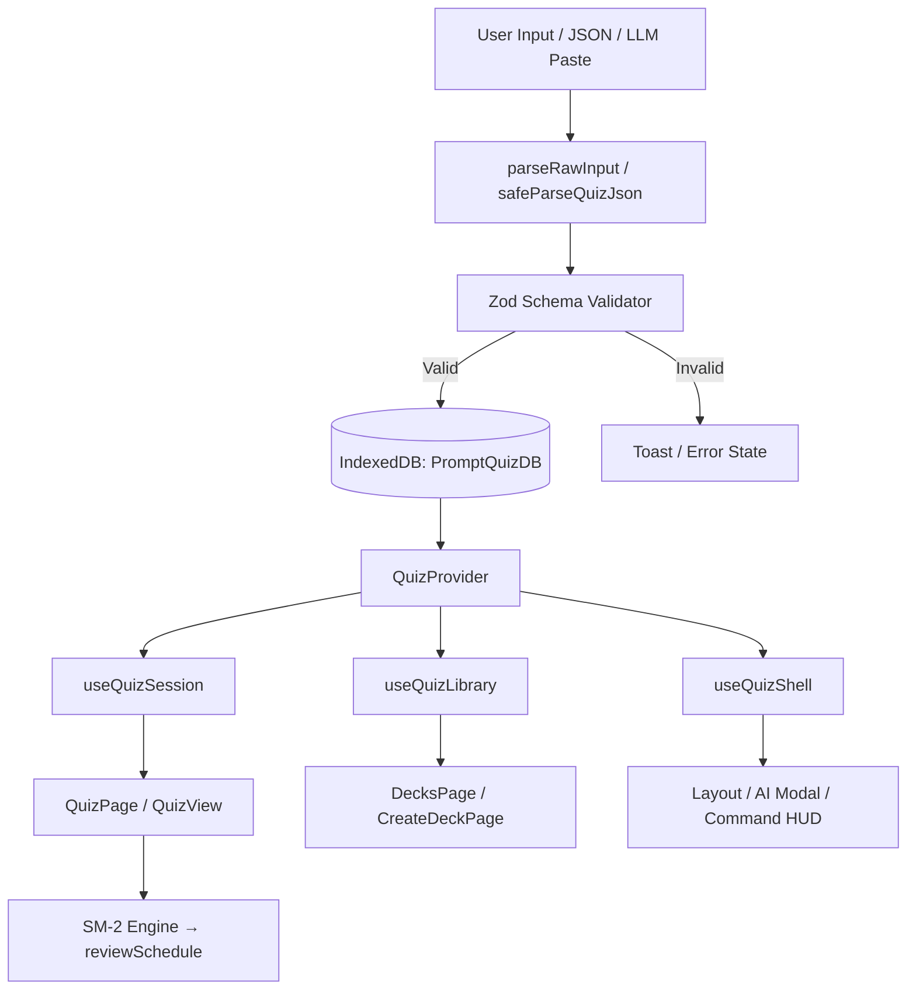

# PromptQuiz

[](https://github.com/IT25100142/promptQuiz/actions/workflows/deploy.yml)
[](https://react.dev/)
[](https://tailwindcss.com/)
[](https://vite.dev/)
[](https://vitest.dev/)
[](#license)

**A privacy-first, offline study app for active recall and spaced repetition — built entirely in the browser.**

[**Live Demo**](https://IT25100142.github.io/promptQuiz/) · [**Report Bug**](https://github.com/IT25100142/promptQuiz/issues) · [**Request Feature**](https://github.com/IT25100142/promptQuiz/issues)

PromptQuiz is a free single-page React application that lets students create quiz decks from JSON or plain text, practice with rich question types, schedule reviews with the SM-2 algorithm, and sync content with external LLMs through a copy-paste AI Prompt Builder. No accounts, no subscriptions, no backend — your decks live in **IndexedDB** on your device.

The interface features a **premium glassmorphism design system**: ambient mesh backgrounds, frosted navigation, fluid card transitions, and polished dark/light themes powered by **Tailwind CSS v4**.

---

## Screenshots & Demo

> Drop your media into `docs/screenshots/` and `docs/assets/`, then replace the placeholders below.

### Live walkthrough

<!-- Option A: embed a GIF -->
<!--  -->

<!-- Option B: link to a screen recording -->
**[Add screen recording here](docs/assets/demo.mp4)** — _Replace with your `.mp4`, `.webm`, or YouTube/Loom link_

### Library dashboard

<!--  -->
_Placeholder: `docs/screenshots/decks-light.png`_

### Quiz session

<!--  -->
_Placeholder: `docs/screenshots/quiz-session.png`_

### Dark mode

<!--  -->
_Placeholder: `docs/screenshots/decks-dark.png`_

---

## Why PromptQuiz?

| Principle | What it means |
| :--- | :--- |
| **Free for students** | No paywalls or subscriptions — study without a credit card |
| **Offline-first** | Full functionality without a network connection after first load |
| **Privacy-first** | No server uploads; study data never leaves your browser |
| **Developer-friendly** | Clean React architecture, Zod validation, Vitest tests, documented in [`PROJECT_CONTEXT.md`](PROJECT_CONTEXT.md) |
| **AI-assisted, not AI-dependent** | Generate prompts for Gemini, Claude, or ChatGPT — paste structured responses back in |

---

## Core Features

| Feature | Description |
| :--- | :--- |
| **Active recall sessions** | Five question types, navigation, shuffle, Zen mode, mistake review |
| **IndexedDB persistence** | Decks → Quizzes → Questions hierarchy in `PromptQuizDB` |
| **SM-2 spaced repetition** | Rate recall quality (1–5); smart review scheduling per card |
| **AI Prompt Builder** | Copy prompts to external LLMs; paste responses back — no API keys |
| **Library backup** | Export/import full library as validated JSON snapshots |
| **Command HUD** | `Ctrl+K` / `⌘K` — search decks, export, toggle theme, focus mode |

---

## Quick Start

**Requirements:** Node.js 20+, npm 9+

```bash
git clone <your-repository-url>
cd promptQuiz
npm install
npm run dev
```

Open **http://localhost:5173** — the app redirects `/` to `/decks`.

If you hit peer dependency errors with React 19:

```bash
npm install --legacy-peer-deps
```

### Production build

```bash
npm run build
npm run preview   # serve /dist at http://localhost:4173/promptQuiz/
```

---

## Deployment

PromptQuiz is configured for **GitHub Pages** at `https://<username>.github.io/promptQuiz/`.

### Automatic deploys

Pushes to the **`main`** branch trigger [`.github/workflows/deploy.yml`](.github/workflows/deploy.yml), which:

1. Installs dependencies with `npm ci`
2. Runs `npm run build`
3. Deploys the `dist` folder to GitHub Pages via `actions/deploy-pages@v4`

### One-time GitHub setup

1. Push this repository to GitHub (repository name: **`promptQuiz`**).
2. Go to **Settings → Pages → Build and deployment**.
3. Set **Source** to **GitHub Actions** (not “Deploy from a branch”).
4. After the first successful workflow run, update the Live Demo link at the top of this README with your GitHub username.

### SPA routing on GitHub Pages

- `vite.config.js` sets `base: '/promptQuiz/'`.
- `BrowserRouter` uses `import.meta.env.BASE_URL` as `basename`.
- `public/404.html` plus the restore script in `index.html` handle direct links to routes like `/decks` and `/quiz`.

If you rename the repository, update the `base` path in `vite.config.js` and `pathSegmentsToKeep` in `public/404.html` to match.

---

## Routes

| Path | Page | Purpose |
|------|------|---------|
| `/` | → `/decks` | Redirect to library |
| `/decks` | DecksPage | Library dashboard, import/export, study launch |
| `/create-deck` | CreateDeckPage | Paste or import questions into a new deck |
| `/quiz` | QuizPage | Active recall session |
| `/results` | ResultsPage | Score summary and restart |

---

## Typical Workflow

1. **Create a deck** — Go to `/create-deck`, paste JSON or AI block text, submit.
2. **Study** — From `/decks`, click **Study** on a quiz.
3. **Answer and rate** — Complete questions; rate recall quality for SM-2 scheduling.
4. **Review** — View results at `/results`; restart or review mistakes.
5. **Backup** — Export library JSON from `/decks` regularly.

### AI-assisted deck creation

1. Click **AI Builder** in the header.
2. Set topic, question count, and types → copy the generated prompt.
3. Send to an external LLM (Gemini, Claude, ChatGPT).
4. Paste the response → validated and saved to your deck.

**Tip:** Use blank-line-separated blocks with `*` marking correct answers — designed for LLM output.

---

## Tech Stack

| Layer | Technology |
|-------|------------|
| UI | React 19, React Router 7 |
| Styling | Tailwind CSS v4 (`@tailwindcss/vite`) |
| Build | Vite 8 |
| Storage | IndexedDB + localStorage |
| Validation | Zod v4 |
| Testing | Vitest 4, Testing Library, fake-indexeddb |
| Linting | ESLint 9 (flat config), jsx-a11y |

**Not included:** Backend server, REST/GraphQL API, authentication, environment variables, or third-party LLM API calls.

---

## Architecture

PromptQuiz is a **pure client-side SPA**. Data flows from user input through parsers and Zod validation into IndexedDB; React context drives the UI.



### Three-slice context

`QuizProvider` splits state to minimize re-renders:

- **`useQuizSession`** — Active quiz, answers, navigation, shuffle, SM-2 ratings
- **`useQuizLibrary`** — Deck CRUD, JSON input, IndexedDB sync
- **`useQuizShell`** — Toasts, AI modal, parse messages

Reducer and hooks live in `src/features/quiz/hooks/`. Persistence is centralized in `src/shared/services/indexedDB.js`.

### IndexedDB schema (v2)

```
decks → quizzes → questions
                    ↓
              reviewSchedule (SM-2 metadata per question)
```

For full schema fields, API surface, and contributor guidelines, see [`PROJECT_CONTEXT.md`](PROJECT_CONTEXT.md).

---

## Question Types & Import Formats

**Types:** `multiple-choice`, `true-false`, `fill-blank`, `cloze`, `short-answer`

**Import formats:** JSON array, AI block text (recommended), Markdown headers, CSV-style lists.

Example AI block:

```text
[T/F] React 19 works with Vite 8.
*True

[FIB] The hook for side effects is ______.
*useEffect

What does CSS stand for?
A. Creative Style Sheets
B. Cascading Style Sheets
*Cascading Style Sheets
```

JSON and full schema definitions: `src/shared/schemas/quizQuestions.js`

---

## NPM Scripts

| Command | Description |
|---------|-------------|
| `npm run dev` | Dev server with HMR (port **5173**) |
| `npm run build` | Production build → `/dist` |
| `npm run preview` | Preview production build |
| `npm run lint` | ESLint check |
| `npm test` | Run Vitest suite once |
| `npm run test:watch` | Vitest watch mode |

---

## Testing

```bash
npm test
npm run lint
```

Tests use **Vitest + jsdom + fake-indexeddb**. Ten test files cover schemas, parsers, IndexedDB, scoring, context, and page flows.

> IndexedDB warnings in some route tests are expected in Node/jsdom and do not fail the suite.

---

## Project Structure

```text
promptQuiz/
├── README.md
├── PROJECT_CONTEXT.md      # Deep technical reference for contributors & AI agents
├── src/
│   ├── App.jsx             # Routes
│   ├── index.css           # Tailwind v4 design system & utilities
│   ├── components/         # Layout, QuizView, CommandHUD, modals
│   ├── contexts/           # QuizContext (three-slice provider)
│   ├── pages/              # Route pages
│   ├── features/           # ai, decks, quiz, ui, questions modules
│   └── shared/
│       ├── schemas/        # Zod validation
│       ├── services/       # indexedDB.js, sm2.js
│       └── utils/          # parsers, helpers
└── vitest.config.js
```

---

## Troubleshooting

| Issue | Solution |
|-------|----------|
| Blank `/quiz` page | Start a quiz from `/decks` first |
| Parse errors | Ensure JSON is an array; text blocks separated by one blank line |
| Data lost on browser clear | Export library JSON regularly from `/decks` |
| 404 on production refresh | Configure SPA fallback to `/index.html` on your host |
| Missing styles | Confirm `@tailwindcss/vite` is in `vite.config.js` |

---

## Contributing

1. Run `npm run lint` and `npm test` before submitting changes.
2. Co-locate tests as `*.test.js` / `*.test.jsx` beside source files.
3. New question types require updates to Zod schemas **and** both parsers (`parsers.js`, `helpers.js`).
4. Read [`PROJECT_CONTEXT.md`](PROJECT_CONTEXT.md) before modifying state, IndexedDB, or import logic.

---

## Author

**Sankalpa KMCP** — First-year IT undergraduate at SLIIT, building practical, privacy-first tools at the intersection of web development and AI-assisted learning.

---

## License

Open-source. Add a `LICENSE` file before public distribution.
