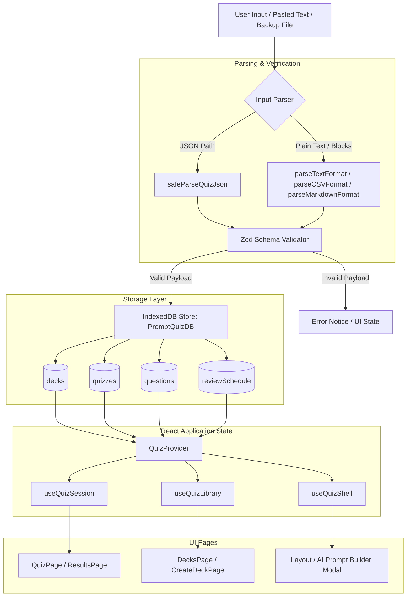

# PromptQuiz 🧠⚡

**PromptQuiz** is a high-performance, single-page React study application built for **active recall** and **spaced repetition**. It allows developers, students, and educators to construct interactive quiz decks from structured JSON or plain-text formats, run quiz sessions directly in the browser with rich scoring, and persist progress locally in **IndexedDB** (`PromptQuizDB`). 

It includes an interactive **AI Prompt Builder** to easily generate prompt instructions for external LLMs (e.g. Gemini, Claude, ChatGPT), allowing users to copy prompts, get structured question outputs, and paste the results back for instant parsing and validation.

---

## 🗺️ Table of Contents

1. [Features](#-features)
2. [Tech Stack](#-tech-stack)
3. [Architecture Overview](#-architecture-overview)
4. [State Management (Three-Slice Context)](#-state-management-three-slice-context)
5. [Data Layer & IndexedDB Schema](#-data-layer--indexeddb-schema)
6. [Spaced Repetition Engine (SM-2 Algorithm)](#-spaced-repetition-engine-sm-2-algorithm)
7. [Quiz Import & Text Formats](#-quiz-import--text-formats)
8. [Question Types & JSON Schema](#-question-types--json-schema)
9. [Prerequisites & Installation](#-prerequisites--installation)
10. [NPM Scripts](#-npm-scripts)
11. [Testing & Quality Assurance](#-testing--quality-assurance)
12. [Troubleshooting Guide](#-troubleshooting-guide)
13. [Project Directory Structure](#-project-directory-structure)
14. [Contributing & Code Quality](#-contributing--code-quality)
15. [License](#-license)

---

## 🌟 Features

| Area | Features & Specifications |
| :--- | :--- |
| **Active Recall Sessions** | Multi-type question support, backward/forward navigation, quiz shuffling, progress metrics, self-assessment for open questions, and error review. |
| **Flexible Importing** | Raw JSON array ingestion, CSV-like lists, Markdown headers, or plain-text "AI block format" (blank-line separated blocks). |
| **IndexedDB Data Store** | Persistent client-side deck hierarchy (Decks → Quizzes → Questions) using transactional IndexedDB, completely offline. |
| **Spaced Repetition** | SM-2 memory scheduling algorithm calculates optimal next review dates based on card-level self-assessments (easy, correct, hard, vague). |
| **AI Prompt Builder** | In-app modal helper generates pre-formatted LLM prompts based on study notes and desired shapes, instantly validating pasted responses. |
| **Backup & Portability** | JSON library snapshot export and import (replace mode) with strict Zod validation schema. |

---

## 🛠️ Tech Stack

- **UI Framework:** React 19 (Hooks, Context, useReducer)
- **Routing:** React Router 7 (`BrowserRouter`, routes for `Home`, `Create`, `Quiz`, `Results`, `Decks`)
- **Styling:** Tailwind CSS v4 (using the `@tailwindcss/vite` compiler)
- **Client Storage:** Native IndexedDB + LocalStorage (for last-active state tracking)
- **Data Validation:** Zod v4 (verifies question structures and backup snapshot integrity)
- **Build System:** Vite 8
- **Testing:** Vitest 4 + jsdom + `@testing-library/react` + `@testing-library/user-event`
- **Linting:** ESLint 10 (Flat Config) + `jsx-a11y` recommended rules

---

## 🏗️ Architecture Overview

The application utilizes a purely client-side architecture that decouples input parsing, structural validation, offline persistence, and session state.



---

## 🧬 State Management (Three-Slice Context)

To prevent broad component re-renders across deep layout trees, `QuizProvider` splits the state into three memoized context slices. Components subscribe only to the slice they need.

```
                  ┌──────────────────────┐
                  │     QuizProvider     │
                  └──────────┬───────────┘
         ┌───────────────────┼───────────────────┐
         ▼                   ▼                   ▼
┌──────────────────┐┌──────────────────┐┌──────────────────┐
│  useQuizSession  ││  useQuizLibrary  ││  useQuizShell   │
│                  ││                  ││                  │
│ • Quiz list & idx││ • Raw input JSON ││ • Toast notifications
│ • Answers array  ││ • Saved deck list││ • AI modal status│
│ • Scoring states ││ • Loading states ││ • Temp parser msg│
│ • Navigation     ││ • Create/Del deck││                  │
└──────────────────┘└──────────────────┘└──────────────────┘
```

- **`useQuizSession`**: Controls active learning loops. Contains answer arrays, session navigation (`goNext`, `goPrevious`), shuffle states, and self-assessment scores.
- **`useQuizLibrary`**: Manages the deck library. Performs file reads/writes to IndexedDB, creates/deletes folders/decks, and runs standard backup snapshot workflows.
- **`useQuizShell`**: Manages layout and global overlays, including modal visibilities (AI Prompt Builder) and temporary success/error notices.

---

## 💾 Data Layer & IndexedDB Schema

PromptQuiz uses a relational-like schema modeled inside IndexedDB database name `PromptQuizDB` (Version `2`).

### Object Store Specifications

#### 1. `decks` (Folder Groups)
*   **Key Path:** `id` (auto-increment)
*   **Indexes:** `name`, `date`
*   **Structure:**
    ```typescript
    {
      id: number;
      name: string;
      date: string; // ISO timestamp
      description: string;
    }
    ```

#### 2. `quizzes` (Sub-files inside Decks)
*   **Key Path:** `id` (auto-increment)
*   **Indexes:** `name`, `deckId`, `date`
*   **Structure:**
    ```typescript
    {
      id: number;
      deckId: number; // Foreign key referencing decks.id
      name: string;
      date: string;
      description: string;
    }
    ```

#### 3. `questions` (Individual items inside Quizzes)
*   **Key Path:** `id` (auto-increment)
*   **Indexes:** `quizId`, `deckId`, `order`
*   **Structure:**
    ```typescript
    {
      id: number;
      quizId: number; // Foreign key referencing quizzes.id
      deckId: number; // Foreign key referencing decks.id
      order: number;  // Sorting sequence
      type: 'multiple-choice' | 'true-false' | 'fill-blank' | 'cloze' | 'short-answer';
      question: string;
      date: string;
      // conditional properties based on type:
      options?: string[];
      answer?: string | boolean;
      answerIndex?: number;
      answers?: string[];
      suggestedAnswer?: string;
    }
    ```

#### 4. `reviewSchedule` (Spaced Repetition Metadata)
*   **Key Path:** `id` (auto-increment)
*   **Indexes:** `questionId` (unique), `nextReviewDate`, `deckId`
*   **Structure:**
    ```typescript
    {
      id: number;
      questionId: number; // References questions.id
      deckId: number;     // References decks.id
      interval: number;   // Days to next check
      easeFactor: number; // SM-2 ease multiplier
      nextReviewDate: string; // ISO date
      createdDate: string;
      lastReviewedDate?: string;
    }
    ```

---

## 📈 Spaced Repetition Engine (SM-2 Algorithm)

When Spaced Repetition is active, answer responses are fed to the SuperMemo-2 (SM-2) algorithm (`src/shared/services/indexedDB.js`). Users rate their performance quality:
- **`5` (Perfect):** Instant, accurate recall.
- **`4` (Correct):** Accurate recall with slight hesitation.
- **`3` (Difficult):** Recalled correctly, but required significant mental effort.
- **`2` (Vague):** Incorrect response, but the correct answer felt obvious upon review.
- **`1` (No Recall):** Complete failure to recall.

### Mathematical Realization
The new Ease Factor ($EF'$) is updated dynamically:
$$EF' = \max\left(1.3, EF + (0.1 - (q \times 0.02))\right)$$
*Where $q$ is the performance quality ($1$ to $5$).*

The Next Review Interval ($I'$) in days is updated via:
$$I' = \max\left(1, \text{round}\left(I \times EF'^{(q - 5)}\right)\right)$$

This calculation generates the next review timestamp, which is queried on application load for the daily review system.

---

## 📝 Quiz Import & Text Formats

PromptQuiz supports multiple plain-text formats in addition to standard JSON. The parser automatically detects the format of pasted text.

### 1. Block Text / AI Prompt Format (Recommended)
Separate each question block with a **blank line**. Mark the correct option/answer with an asterisk `*`.

```text
[T/F] React 19 introduces Server Components.
*True

[FIB] The hook used to perform side effects in React is ______.
*useEffect

[CLOZE] A Cloze deletion hides specific words like {0} and {1} in a sentence.
*words, sentence

[SA] Explain the virtual DOM in React.
*The virtual DOM is a programming concept where a virtual representation of a UI is kept in memory and synced with the real DOM via reconciliation.

What does CSS stand for?
A. Creative Style Sheets
B. Cascading Style Sheets
C. Computer Style Sheets
*B
```

### 2. Markdown Format
Separate questions using headers (`#` or `##`) and bullet lists.
```markdown
# What does HTTP stand for?
- High Transfer Text Protocol
- HyperText Transfer Protocol
- *HyperText Transfer Protocol
- Home Tool Transfer Protocol
```

### 3. CSV / Semi-Structured Format
Define stems explicitly with options starting with letters.
```csv
Question: Which hook manages local state?
A. useMemo
B. useState
C. useEffect
*useState
```

---

## 📐 Question Types & JSON Schema

Below are the exact Zod structural definitions for each question type (`src/shared/schemas/quizQuestions.js`):

### 1. Multiple Choice
```json
{
  "type": "multiple-choice",
  "question": "What is Vite?",
  "options": ["A Database", "A Bundler / Dev Server", "A Testing Library"],
  "answer": "A Bundler / Dev Server",
  "answerIndex": 1
}
```

### 2. True / False
```json
{
  "type": "true-false",
  "question": "React uses a virtual DOM.",
  "answer": true
}
```

### 3. Fill in the Blank (FIB)
```json
{
  "type": "fill-blank",
  "question": "React uses the ___ hook to register state.",
  "answers": ["useState"]
}
```

### 4. Cloze Deletion
Uses index braces `{0}`, `{1}` mapped directly to an ordered array of answers.
```json
{
  "type": "cloze",
  "question": "The {0} hook returns a state value and a function to {1} it.",
  "answers": ["useState", "update"]
}
```

### 5. Short Answer
Includes a suggested answer for self-directed review verification.
```json
{
  "type": "short-answer",
  "question": "Describe JSX.",
  "suggestedAnswer": "JSX is a syntax extension to JavaScript that allows you to write HTML-like structures in React code."
}
```

---

## ⚡ Prerequisites & Installation

### System Requirements
- **Node.js** 20.0.0 or higher
- **npm** 9.0.0 or higher

### Set Up Local Workspace

1. Clone the repository:
   ```bash
   git clone <your-repository-url>
   cd promptQuiz
   ```

2. Install dependencies:
   ```bash
   npm install
   ```
   > [!NOTE]
   > If you encounter peer dependency errors (common when working with React 19 plugins), run:
   > `npm install --legacy-peer-deps`

3. Launch the development server:
   ```bash
   npm run dev
   ```

Open `http://localhost:5173` in your browser.

---

## 📋 NPM Scripts

Available npm scripts in `package.json`:

| Command | Action | Description |
| :--- | :--- | :--- |
| `npm run dev` | `vite` | Spins up the Vite dev server with Hot Module Replacement (HMR). |
| `npm run build` | `vite build` | Compiles source files into highly optimized production assets in `/dist`. |
| `npm run preview` | `vite preview` | Locally hosts the production build output from `/dist` for testing. |
| `npm run lint` | `eslint .` | Runs static code analysis across files using ESLint Flat configs. |
| `npm test` | `vitest run` | Runs Vitest test suite once (ideal for CI pipelines). |

---

## 🧪 Testing & Quality Assurance

The test suite runs on **Vitest** and utilizes JSDOM to mock browser components.

### Test Execution Commands
*   Run tests once:
    ```bash
    npm test
    ```
*   Run Vitest in watch mode (interactive):
    ```bash
    npx vitest
    ```
*   Check code formatting & quality:
    ```bash
    npm run lint
    ```

> [!WARNING]
> **IndexedDB Test Warnings:** When running route tests, you may notice `Error: Failed to get decks: indexedDB is not defined` printed to standard error. This occurs because the Node jsdom test environment lacks a native IndexedDB implementation. These errors are handled gracefully by partial mocks in components, and the test suite will still complete successfully.

---

## 🔍 Troubleshooting Guide

| Issue | Cause | Solution |
| :--- | :--- | :--- |
| **Blank Quiz Screen** | Navigated directly to `/quiz` without starting a session or loading a deck. | Go back to `Home` or `Decks`, choose or import a set of questions, and click **Start Quiz**. |
| **Failed to parse questions** | Pasted text has invalid JSON syntax or incorrect line formats. | Verify JSON begins with `[` (array root). For plain text, ensure question blocks are separated by **exactly one blank line**. |
| **Library missing on refresh** | Browser cache was wiped, clearing IndexedDB. | Regularly use **Export library** on the `/decks` page to download a `.json` backup file. |
| **404 error on page refresh in production** | Static host doesn't route unknown paths to `/index.html` (SPA Routing issue). | Configure your web host (Netlify, Vercel, Nginx) to fallback missing paths to `/index.html`. |
| **Tailwind v4 styles missing** | Vite plugin configuration mismatch. | Ensure your bundler is running Vite 8 and `@tailwindcss/vite` is loaded in `vite.config.js`. |

---

## 📂 Project Directory Structure

```text
promptQuiz/
├── eslint.config.js          # ESLint 10 Flat config with React rules
├── index.html                 # Main entry template
├── package.json              # Project scripts & dependencies
├── vite.config.js            # Vite configurations & plugins
├── README.md                 # Project documentation
└── src/
    ├── main.jsx              # Application mount point (React DOM & Router)
    ├── App.jsx               # Routes definition & Global providers
    ├── index.css             # Tailwind v4 injection point
    ├── components/           # Generic visual wrappers & structural components
    ├── contexts/             # Application Context Hooks (State slicing)
    │   └── QuizContext.jsx   # Exposes useQuizSession, useQuizLibrary, useQuizShell
    ├── pages/                # Route components (Home, CreateDeck, Quiz, Results, Decks)
    ├── features/             # Business modules
    │   ├── ai/               # AI prompt generator forms & prompts
    │   ├── decks/            # Local folder library tree components
    │   ├── questions/        # Question-specific creation overlays
    │   ├── quiz/             # Core Reducer & custom React hooks
    │   └── ui/               # Layout components & header bars
    ├── shared/               # Cross-component resources
    │   ├── schemas/          # Zod validation schemas
    │   ├── services/         # IndexedDB wrapper and SM-2 core functions
    │   └── utils/            # Helper formats, CSV/MD/Block parsers, and unit tests
    └── test/                 # Testing environment configs & mock environments
```

---

## 🤝 Contributing & Code Quality

1.  **Maintain ESLint Compliance:** Run `npm run lint` before committing code. Avoid creating unused arguments or variables unless prefixed with an underscore `_`.
2.  **Test Integration:** If writing new components, include matching `.test.js` or `.test.jsx` files beside the source.
3.  **Schema Alignment:** If adding a new question type, update the parser in `src/shared/utils/helpers.js` and the Zod schemas in `src/shared/schemas/quizQuestions.js` to ensure imports, exports, and active sessions all parse correctly.

---

## 📄 License

This project is open-source. For public distribution, please include a `LICENSE` file in the root directory.
